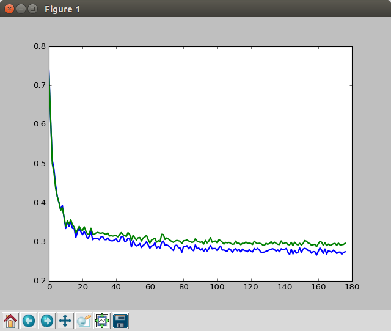
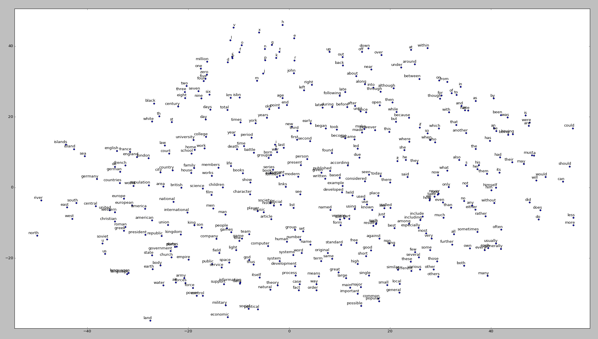

# Deep Learning Udacity
* Self-study of [Udacity Deep Learning](https://www.udacity.com/course/deep-learning--ud730)
 
# Folder structure
* `udacity_notebook`: Udacity homework, which is copied from [https://github.com/tensorflow/tensorflow/tree/master/tensorflow/examples/udacity](https://github.com/tensorflow/tensorflow/tree/master/tensorflow/examples/udacity)
* `tensorflow_examples`: Extract essential from the homework.

# Tensorflow Examples
## `MLP_notMNIST`


* With the configuration
```
learning_params = {
    'n_layer1': 1024,
    'n_layer2': 512,
    'n_layer3': 256,
    'batch_size': 300,
    'dropout_probability': 0.7,
    'training_epochs': 1000,
    'max_test_time': 60*60*5,
    'starter_learning_rate': 0.1,
    'beta_regularization_value': 0.001
}
```

* The Cross entropy is saturated at ~50 epoch


* Results
```
# epoch complete: step 133199 num_training 39960000 time:5:00:04.257040
# epoch complete: Train [CrossEntropy / Training Accuracy] 0.2387 / 0.9590
# Validation [CrossEntropy / Training Accuracy] 0.3955 / 0.9148
# BREAK: TIME OVER
# Complete training. Total time:5:00:13.045505
# Testing [CrossEntropy / Training Accuracy] 0.2168 / 0.9653
```

## `CONV_notMNIST`
* With the configuration
 * Similar to [LeNet5](http://culurciello.github.io/tech/2016/06/04/nets.html)
```
learning_params = {
    'patch_size': 3,
    'depth_1': 8,
    'depth_2': 16,
    'depth_3': 32,
    'hidden_n_output_1': 256,
    'hidden_n_output_2': 128,
    'batch_size': 128,
    'dropout_probability': 0.7,
    'training_epochs': 10000,
    'max_test_time': 60 * 60 * 9,
    'starter_learning_rate': 0.1,
    'beta_regularization_value': 0.001
}
```

* Test accuracy: 96.98%
 * With a CNN layout with following configurations, which is similar to [LeNet5](http://culurciello.github.io/tech/2016/06/04/nets.html)
 * However there is little difference
```
convolutional (3x3x8)
max pooling (2x2)
dropout (0.7)
relu

convolutional (3x3x16)
max pooling (2x2)
dropout (0.7)
relu

convolutional (3x3x32)
avg pooling (2x2): according to above article
dropout (0.7)
relu

fully-connected layer (265 features)
relu
dropout (0.7)

fully-connected layer (128 features)
relu
dropout (0.7)

softmax (10)

decaying learning rate starting at 0.1
batch_size: 128

Training accuracy: 93.4%
Validation accuracy: 92.8%
```

* The Cross entropy is saturated at ~100 epoch




* Results
```
epoch complete: step 276473 num_training 35388672 time:9:01:38.853269
epoch complete: Train [CrossEntropy / Training Accuracy] 0.2745 / 0.9331
Validation [CrossEntropy / Training Accuracy] 0.2966 / 0.9262
BREAK: TIME OVER
Complete training. Total time:9:01:57.943160
Testing [CrossEntropy / Training Accuracy] 0.1643 / 0.9698
```

## `word2vec`
* Use skip gram algorithm
 * check [CS224d: Deep Learning for Natural Language Processing](http://cs224d.stanford.edu/lecture_notes/notes1.pdf)
 * The implementation uses [sampled softmax](https://github.com/tensorflow/tensorflow/blob/master/tensorflow/python/ops/nn.py#L1127), rather than Negative Sampling, which Mikolov used in his paper.
 * In my opinion, sampled softmax is more intuitive than Mikolov's Negative Sampling, which is weird sigmoid approximation.
 * The basic idea for both approximation is same. Choose small number of negative samples.
* TODO: implement [GloVe](http://nlp.stanford.edu/pubs/glove.pdf)

* Results
```
Average loss at step 96000: 3.738376
Average loss at step 98000: 3.848188
Average loss at step 100000: 3.819818
Nearest to often: usually, sometimes, generally, many, commonly, now, these, typically,
Nearest to some: many, these, other, several, those, different, all, are,
Nearest to were: are, was, have, had, be, been, several, many,
Nearest to used: considered, referred, known, use, steinberg, found, available, frequent,
Nearest to to: in, would, for, and, will, can, it, may,
Nearest to see: e, known, called, external, list, tragedies, may, will,
Nearest to years: year, time, centuries, bc, months, hours, shearer, schedules,
Nearest to for: of, to, and, in, with, but, on, as,
Nearest to world: war, presentations, hellboy, astrodome, befell, ally, lepidus, mid,
Nearest to between: over, about, minoan, on, with, neq, howlin, algirdas,
Nearest to d: b, c, f, l, t, r, e, n,
Nearest to been: become, were, be, was, suggested, come, has, have,
Nearest to state: city, general, teaches, government, encrypted, university, hellas, slocum,
Nearest to no: there, any, not, this, a, pipelined, dingo, little,
Nearest to UNK: one, two, and, isbn, seven, eight, five, by,
Nearest to people: those, who, them, some, jewish, groups, american, books,
```

* 2D TSNE (t-distributed Stochastic Neighbor Embedding) for 400 frequent words


## `lstm` RNN (i.e. recurrent neural network)
* Train [text8.zip](http://mattmahoney.net/dc/text8.zip) (17M words), and generate new sentence.
* Configuration
 * Input: word2vec with dimension 300.
 * 2-layer LSTM with dimension 128 of the state.
 * unrolling: 10
 * dropout: 0.5
* Note: text generator needs some randomness. If feeding the `argmax` word generated by RNN into RNN again, the same phrase maybe repeated. :@
Generally, draw a skewed dice (i.e. multinominal distribution with `softmax` probability) among `top_k` words.
Check [keras example](https://github.com/fchollet/keras/blob/master/examples/lstm_text_generation.py#L62)
* Reference
 * [LSTM lecture](http://cs224d.stanford.edu/assignment2/assignment2_sol.pdf)
 * [Karpathy's blog](http://karpathy.github.io/2015/05/21/rnn-effectiveness/)
 * [Karpathy configuration](https://github.com/karpathy/char-rnn/blob/master/train.lua#L38)
 * [LSTM dropout](http://arxiv.org/abs/1409.2329)
 * [LSTM advance](http://arxiv.org/pdf/1409.3215v3.pdf)
* Performance: very slow (1 epoch takes ~210 hours)
 * [LSTM advance](http://arxiv.org/pdf/1409.3215v3.pdf) took 10 days to train 7.5 epochs of 304M words on 8 GPUs.
 * Configuration (384M params): word2vec(1k dimesion), 4 layers with 1k cell for both encoder and decoder (64M params), onehot English(160k) and French(80k)

* Result
```
Average loss at step(4100):6.113260 perplexity:451.81 learning rate:1.00 time:18:20:32.810503 saved:lstm.ckpt
================================================================================
dante s and the original book of the book of a series of books and books in his book and the story of the original book the original version in one eight nine zero and the book is the first story of a story in a series the first year of a book of a fiction film of the film and the series the series in one eight nine eight in one seven nine zero he had a few years
agee and the first of one seven eight one the of the first and one nine six zero and the first time the one eight th year was the second century in one seven six eight the first time was the most famous of its first time in the world in europe and in one nine nine one and was created by the first one nine eight eight s and first in two zero one one in a few years
ashkenazim to have been a huge and rather more than one of its several years the most common and most famous of these were considered to be considered as well as a small number of the other types of the other groups of their and own the most important and of their own and other groups were the most common in the world and they are not the first and the modern and of the modern era the word is
orig the first of one nine eight zero the one nine eight zero and the eight eight zero s one seven nine zero s and the first one seven th centuries in one nine three eight the one nine eight zero s the one seven th edition was created by the one nine eight two s and one zero one eight two nine zero two the one six zero zero and in the world and in one eight nine zero
jurisprudence the first year of the united nations the united nations states and states and states of australia and the united kingdom and the states the states of the united kingdom and england and the states the united states states the states of canada the british parliament and the netherlands is the united parliament the united kingdom is a common member for a single type in a new nation and in united countries it was considered to be a common
================================================================================
Validation set perplexity: 479.42.
```
